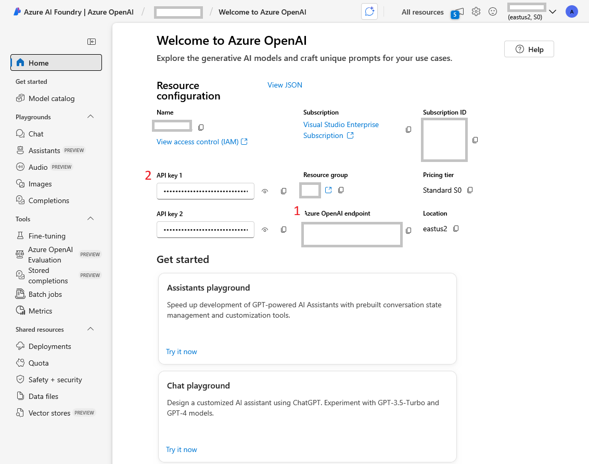
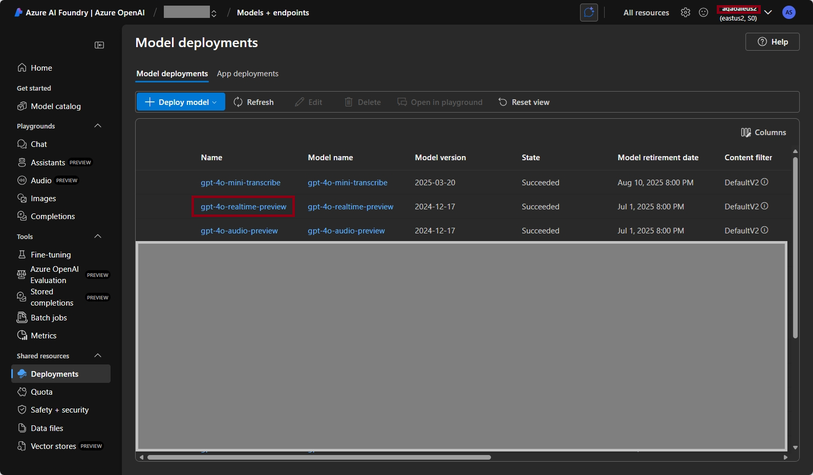

# Getting Started

## Local Tools:
1. [VS Code](https://code.visualstudio.com/)
2. [Dotnet 8 SDK](https://dotnet.microsoft.com/en-us/download/dotnet/8.0)
3. [Git Tools](https://git-scm.com/downloads/win)

## 
1. Verify dot net installation by launching cmd, then run ``dotnet``
2. Verify git installation by running ```git```

## Azure OpenAI Service:
1. Azure OpenAI Service in US-EAST2 or swedencentral region.  or any of these regions where the  [Model Availability] (https://learn.microsoft.com/en-us/azure/ai-services/openai/concepts/models?tabs=global-standard%2Cstandard-chat-completions#models-by-deployment-type)
2. Deploy the following models:
    - gpt-4o-realtime-preview
    - gpt-4o-mini-transcribe

## Local Config Setup 
Set the following environment using this command: `setx VARIABLE_NAME "value"`:
1. AZURE_OPENAI_ENDPOINT: Find this on the overview page. 
2. AZURE_OPENAI_API_KEY: Reference the above screenshot
3. AZURE_OPENAI_DEPLOYMENT: Name of the `gpt-4o-realtime-preview` deployment 